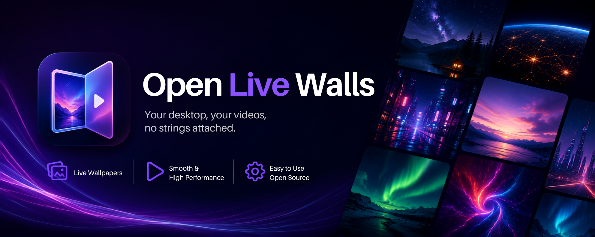

<div align="center">

# OpenLiveWalls

**Open-source live video wallpapers for macOS — local, private, hackable.**

<br />



<br />


<br />
<br />

*Your desktop, your videos, no strings attached.*

</div>

---

## Table of Contents

- [About](#about)
- [Features](#features)
- [Installation](#installation-dmg)
- [Build from Source](#build-from-source)
- [Usage](#usage)
- [Built With](#built-with)
- [Roadmap](#roadmap)
- [Contributing](#contributing)
- [License](#license)
- [Acknowledgments](#acknowledgments)

---

## About

OpenLiveWalls is a macOS menu bar app that turns your local video files into live desktop wallpapers. It also converts and patches videos for macOS native lock screen wallpaper support — all offline, all private.

Unlike commercial alternatives, OpenLiveWalls is fully open-source. No accounts, no cloud, no telemetry. Your wallpapers stay on your machine.

---

## Features

| Feature | Status |
|:--------|:-------|
| Local `.mov` desktop wallpapers | ✅ |
| Import & convert `.mp4` / `.mov` via ffmpeg | ✅ |
| Lock screen wallpaper injection (macOS 26+) | ✅ |
| QuickTime atom patching for compatibility | ✅ |
| Launch at login | ✅ |
| Multi-display support | 🔜 |
| Settings panel | 🚧 Planned |
| Smart power management | 🚧 Planned |

### Current capabilities

**Desktop wallpapers** — Play your local `.mov` files as seamless looping desktop wallpapers. Metal-optimized video playback via AVFoundation with hardware decoding.

**Lock screen conversion** — Import any `.mp4` or `.mov` source, and the app will ffmpeg-transcode it to HEVC, patch the required QuickTime atoms (`csgm`, `sgpd`, `tapt`, `sbgp`, `cslg`), and inject it as a native macOS lock screen wallpaper.

**Privacy-first** — Everything runs locally. No network requests, no data collection, no accounts.

---

## Built With

| Layer | Technologies |
|:------|:-------------|
| Language | Swift 6 |
| UI | AppKit (menu bar) |
| Media | AVFoundation, AVKit, VideoToolbox |
| Tooling | Swift Package Manager, ffmpeg (libx265) |
| Build | `swift build`, `./build.sh` |

---

## Installation (DMG)

Download the latest `OpenLiveWalls.dmg` from [Releases](https://github.com/bl33dz/OpenLiveWalls/releases), then:

1. Open the DMG and drag `OpenLiveWalls.app` to **Applications**
2. Run the **First-Time Setup** steps below
3. Launch the app — it lives in your menu bar

> **Note:** Video conversion requires `ffmpeg` with `libx265`. Install it via:
> ```sh
> brew install ffmpeg
> ```
> Pre-converted `.mov` wallpapers work without ffmpeg.

---

## Build from Source

### Prerequisites

- macOS 26 (tested; macOS 15+ declared as minimum target)
- Xcode Command Line Tools (or Swift 6 toolchain)
- `ffmpeg` with `libx265` support

The app looks for `ffmpeg` in:

- `/opt/homebrew/bin/ffmpeg`
- `/usr/local/bin/ffmpeg`
- `/usr/bin/ffmpeg`
- any `ffmpeg` in `PATH`

```sh
brew install ffmpeg
```

### Build

```sh
swift build
```

Or for a release app bundle:

```sh
./build.sh
```

Output:

```
OpenLiveWalls.app
```

---

## Usage

1. Launch the app — it lives in your menu bar.
2. Use the menu bar item to **Import & Convert** an `.mp4` or `.mov` source video.
3. The converted wallpaper is saved as `{name}.mov` in a `local/` folder next to the app.
4. Supported `.mov` files appear in the menu — click to set as desktop wallpaper.
5. Use the **Apply to Lock Screen** option to set it as your lock screen wallpaper (macOS 26+).

> Only converted `.mov` files that pass atom compatibility checks are shown in the wallpaper list. Import raw files through the app first.

---

## First-Time Setup

macOS may block OpenLiveWalls because it's not notarized (Apple Developer Program required). To fix:

```sh
xattr -dr com.apple.quarantine /Applications/OpenLiveWalls.app
```

Then **right-click** → **Open** the app — this is needed only once.

---

## Previews

### Menu Bar

https://github.com/user-attachments/assets/7e76ac10-404e-4851-8647-72dfe33a6186

### Lock Screen


---

## Roadmap

### Phase 1 — Polish & Settings (Next)
- [ ] **Settings panel** — a dedicated settings window for:
  - Playback frame rate & resolution limits
  - Transition duration & cross-fade between wallpapers
  - Start delay configuration
  - ffmpeg path override
- [ ] **Persistence** — remember last applied wallpaper across launches
- [ ] **Improved diagnostics** — better error messages when atom patching or conversion fails
- [ ] **Replace deprecated API** — modernize thumbnail generation
- [ ] **DMG packaging** — automated `.dmg` build for distribution via GitHub Releases

### Phase 2 — Multi-Display & Power Management
- [ ] **Multi-display support** — independent wallpapers per monitor, per-screen controls
- [ ] **Smart pause** — auto-pause on battery power
- [ ] **Fullscreen detection** — pause when any app enters fullscreen
- [ ] **CPU monitor** — pause when system load exceeds threshold
- [ ] **Display sleep/wake handling** — seamless restore after sleep

### Phase 3 — Advanced Playback
- [ ] **Shuffle mode** — rotate through a collection of wallpapers with configurable interval
- [ ] **Playback speed control** — per-wallpaper speed adjustment
- [ ] **Video volume & mute** — per-display volume control
- [ ] **Wallpaper favorites** — mark and filter saved wallpapers
- [ ] **Import queue** — batch import multiple files with progress

### Phase 4 — Cloud & Community (Stretch)
- [ ] **Wallpaper library browser** — discover and download community wallpapers
- [ ] **Community uploads** — share your converted wallpapers
- [ ] **Sync favorites & settings** — optional iCloud sync
- [ ] **Screen saver support** — native macOS screen saver extension
- [ ] **Video trim & crop** — built-in editor before conversion
- [ ] **Homebrew cask** — `brew install openlivewalls` for easy installation

---

## Contributing

Contributions are welcome! Here's how to help:

1. Fork the repository
2. Create a feature branch (`git checkout -b feature/amazing-feature`)
3. Commit your changes (`git commit -m 'Add amazing feature'`)
4. Push to the branch (`git push origin feature/amazing-feature`)
5. Open a Pull Request

See the [Roadmap](#roadmap) for planned features — or suggest your own in [Issues](https://github.com/bl33dz/OpenLiveWalls/issues).

---

## License

This project is licensed under the GNU General Public License v3.0 — see the [LICENSE](LICENSE) file for details.

---

## Acknowledgments

- [Wallper](https://wallper.app) — feature design and UX reference
- [Backdrop](https://cindori.com/backdrop) — feature design reference
- [LiveWallpaperMacOS](https://github.com/thusvill/LiveWallpaperMacOS) — open-source reference
- [livid-community](https://github.com/aground5/livid-community) — video conversion approach reference
- `ffmpeg` — the backbone of video conversion
